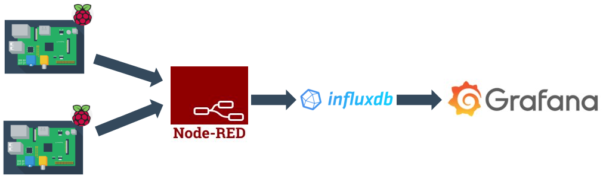
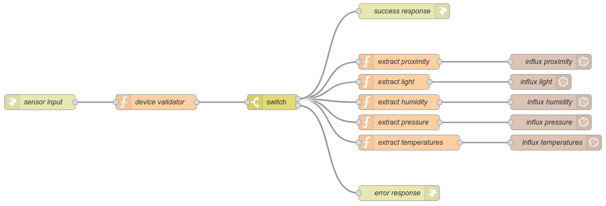
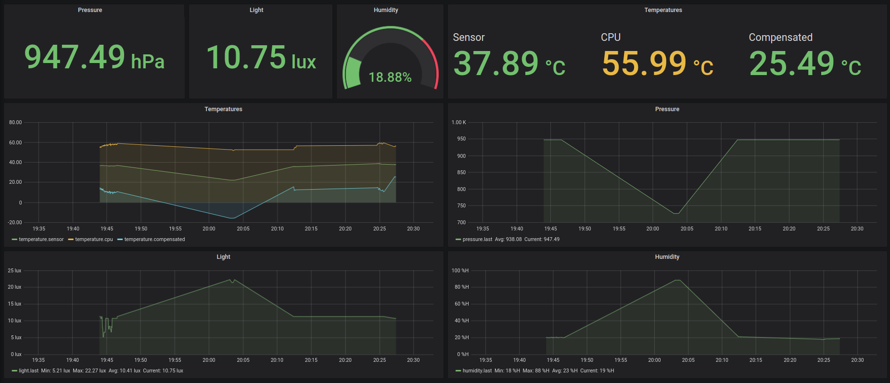

# Node-RED + InfluxDB + Grafana
## Description
This backend has near to zero code and it's based on configuring diferent platforms:

* [InfluxDB]: a really good database for storing time based data. Just like sensor readings :)
* [Node-RED]: an automation tool we use here to publish an HTTP POST endpoint, validate, extract and store sensor readinds in InfluxDB.
* [Grafana]: a visualization tool we use for building a dashboard where data can be watched properly.

When using this backend, data generated on the collector flows like this:



## Deployment
Just clone this repo, get into the [nodered-influxdb-grafana](./nodered-influxdb-grafana) directory and run the `install.sh` script. It will pull docker images, run the containers and set some params needed in Node-RED.

```sh
./install.sh
```

This command is only needed the first time so new nodes are installed in Node-RED. Further on, you can run the stack the common way:

```sh
docker-compose up
```

and stop it the same way:

```sh
docker-compose down
```

## Platforms
### InfluxDB
There's no much to say, it's used for storing data. These are the configuration params used to deploy the container:

| PARAMETER                 | VALUE         |
|---------------------------|---------------|
| INFLUXDB_GRAPHITE_ENABLED | true          |
| INFLUXDB_DB               | sensors       |
| INFLUXDB_ADMIN            | admin         |
| INFLUXDB_ADMIN_PASSWORD   | adminPassw0rd |
| PORTS EXPOSED             | 8086, 2003    |

### Node-RED
#### Details
In Node-RED, we install two nodes not included in the base docker image:

  * `node-red-contrib-influxdb`: to connect to the InfluxDB database.
  * `node-red-contrib-httpauth`: to use `basic` or `digest` HTTP authentication.

The basic flow is similar to this one:



Most nodes are quite common. The only custom code is on functions nodes:

* `device validator`: validates that the device header `x-device-id` is included in the HTTP query.
* `extract X`: as we are storing values in diferent meassurements in InfluxDB, this functions extract values related to each meassure so data fits in place.

Flows in Node-RED expose two endpoints:

* http://localhost:1880/sensors: no auth, only device header validation.
* http://localhost:1880/sensors-auth: basic auth (device header is also validated)

#### Access
You can access the platform with this info:

| Platform | URL                         | User  | Password      |
|----------|-----------------------------|-------|---------------|
| Node-RED | http://localhost:1880/admin | admin | adminPassw0rd |

Flows should be preloaded and already deployed during startup.

### Grafana
#### Details
Grafana is used just to visualize data in a dashboard like this:



#### Access
You can access Grafana as admin with this info:

| Platform | URL                         | User  | Password      |
|----------|-----------------------------|-------|---------------|
| Grafana  | http://localhost:3000/      | admin | adminPassw0rd |

Once you log in, Grafana will ask you to end the setup by adding users and exploring the modules section. The _"Enviro Sensor"_ dashboard sould be already loaded and getting info from InfluxDB.
